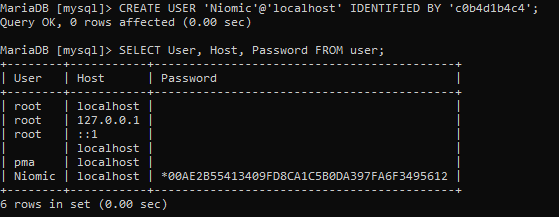
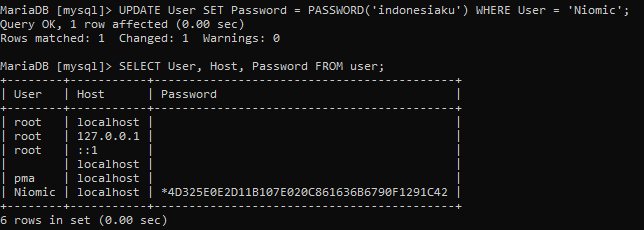
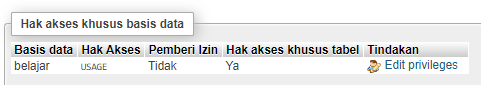
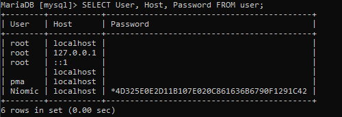
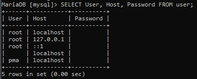

# Tugas_11_MySQL

### 1. Buatlah user baru dengan nama Niomic dengan password c0b4d1b4c4!
```mysql
CREATE USER 'Niomic'@'localhost' IDENTIFIED BY 'c0b4d1b4c4';
```



### 2. Ubah password menjadi indonesiaku dengan perintah update set
```mysql
UPDATE User SET Password = PASSWORD('indonesiaku') WHERE User = 'Niomic';
```



### 3. Berikan hak akses ke user Niomic untuk tabel mahasiswa pada database belajar
```mysql
GRANT ALL ON belajar.mahasiswa TO Niomic@localhost;
```



### 4. Hapus user Niomic
###   SEBELUM DIHAPUS


###   SETELAH DIHAPUS
```mysql
DROP USER 'Niomic';
```


